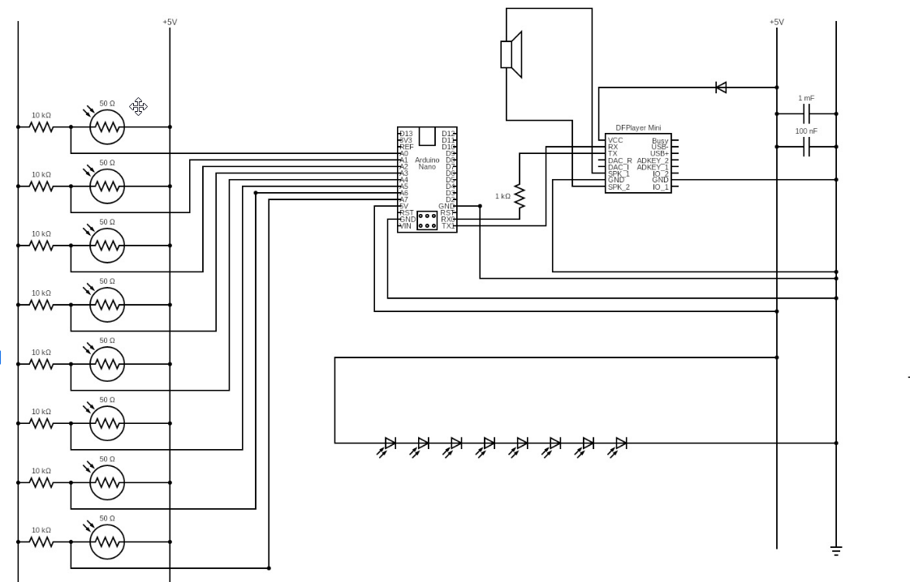

# 🎵 Laser Lyre

A contactless musical instrument that plays lyre notes when laser beams are interrupted — like plucking invisible strings. Built around an Arduino Nano and a DFPlayer Mini, it uses 8 LDR (light-dependent resistor) sensors to detect beam breaks and trigger pre-recorded audio tracks in real time.

---

## 📸 Circuit Diagram



---

## 🎯 How It Works

Eight laser beams are aimed at eight LDR sensors arranged like the strings of a lyre. When a hand (or finger) passes through a beam, the corresponding LDR detects the drop in light and the Arduino triggers the DFPlayer Mini to play the matching note audio file from a microSD card.

On startup, the system **auto-calibrates** by reading each sensor 20 times and setting a threshold 100 ADC units below the ambient average — so it adapts to your room's lighting conditions without any manual tuning.

---

## 🔩 Hardware

| Component | Details |
|---|---|
| Microcontroller | Arduino Nano (ATmega328P, **old bootloader**) |
| Audio module | DFPlayer Mini |
| Sensors | 8× LDR (Light-Dependent Resistor), 50 Ω |
| Pull-down resistors | 8× 10 kΩ (one per LDR) |
| DFPlayer serial resistor | 1 kΩ (on TX line) |
| Decoupling capacitors | 1 mF + 100 nF (on DFPlayer VCC) |
| Speaker | 8 Ω passive speaker |
| Power | +5 V (USB or regulated supply) |
| Lasers | 8× laser diode modules (one per string) |
| LEDs | 8× indicator LEDs (optional, one per string) |

---

## ⚡ Circuit Overview

- Each LDR is wired in a **voltage divider** with a 10 kΩ pull-down resistor between +5 V and GND, with the midpoint connected to an analog pin (A0–A7).
- The DFPlayer Mini communicates over **SoftwareSerial** (pins D10/D11) through a 1 kΩ resistor on the TX line.
- A **1 mF + 100 nF** capacitor pair on the DFPlayer's VCC line filters power noise for clean audio.
- A protection diode on the speaker line prevents back-EMF damage.

See the full schematic in the  the diagram above.

---

## 📁 Repository Structure

```
Laser-Lyre/
├── laser_lyre.ino        # Arduino sketch
├── circuit/              # Schematic / circuit diagram
├── 3d-files/             # 3D-printable enclosure & frame parts  ← separate GitHub folder
└── audio/                # Lyre note .mp3 files for the SD card  ← separate GitHub folder
```

> **Note:** The 3D print files and audio files are hosted in their own linked GitHub repositories. See the links below.

---

## 🖨️ 3D Files

Printable enclosure and sensor mount parts are available in the **3D Models** folder:  
👉 [3D Files – GitHub](https://github.com/Aadvaith-Mandampully/Laser-Lyre/tree/main/3D%20models)

---

## 🎶 Audio Files

Pre-recorded lyre note `.mp3` files for the SD card are available in the **SD card Files** folder:  
👉 [Audio Files – GitHub](https://github.com/Aadvaith-Mandampully/Laser-Lyre/tree/main/SD%20card%20Files)

### SD Card Setup

1. Format a microSD card as **FAT32**.
2. Place the audio files in the root directory.
3. Name them exactly `0001.mp3`, `0002.mp3`, … `0008.mp3` (DFPlayer requires zero-padded 4-digit filenames).
4. Insert into the DFPlayer Mini's card slot.

---

## 💾 Software

### Dependencies

Install these libraries via the Arduino Library Manager:

- [`DFRobotDFPlayerMini`](https://github.com/DFRobot/DFRobotDFPlayerMini) by DFRobot
- `SoftwareSerial` (built into Arduino IDE)

### Uploading

> ⚠️ **Important:** This sketch targets the Arduino Nano with the **ATmega328P (Old Bootloader)**. When uploading, select:
>
> - **Board:** Arduino Nano  
> - **Processor:** ATmega328P **(Old Bootloader)**
>
> Using the wrong bootloader will cause upload failures.

1. Install the Arduino IDE.
2. Install the `DFRobotDFPlayerMini` library.
3. Open `laser_lyre.ino`.
4. Select the correct board and processor as above.
5. Upload over USB.

---

## 🔧 Configuration

All tuneable parameters are at the top of `laser_lyre.ino`:

| Parameter | Default | Description |
|---|---|---|
| `numStrings` | `8` | Number of laser strings |
| `sensorPins[]` | `A0–A7` | Analog pins for each LDR |
| `trackNumbers[]` | `1–8` | SD card track index per string |
| `volume` | `25` | DFPlayer volume (0–30) |
| Calibration offset | `-100` | ADC units below ambient to set threshold |

If beams are triggering too easily or not at all, adjust the calibration offset (`avg - 100`) in `setup()` to suit your environment.

---

## 🚀 Getting Started

1. Print and assemble the frame using the 3D files.
2. Wire the circuit as shown in the schematic.
3. Prepare the SD card with the audio files (named `0001.mp3`–`0008.mp3`).
4. Upload the sketch to the Arduino Nano (old bootloader).
5. Align the lasers so each beam hits its corresponding LDR.
6. Power on — the Arduino will calibrate automatically on startup (takes ~1 second).
7. Break a beam to play a note. 🎵

---

